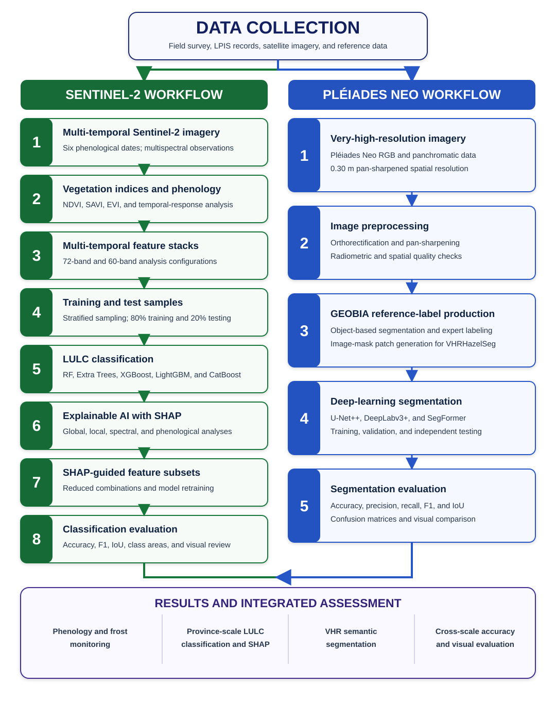

# Determining the Spatial Distribution of Hazelnut Areas in Sakarya Province Using Satellite Data-Based Deep Learning and Explainable Machine Learning Techniques

<div align="justify">

Official companion repository for the master's thesis conducted in the **Geomatics Engineering Programme, Istanbul Technical University**.

</div>

<div align="justify">

This study develops a multi-resolution GeoAI framework for mapping and monitoring hazelnut orchards in Sakarya Province, Türkiye. It combines multi-temporal Sentinel-2 observations, vegetation-index time series, tree-based ensemble classifiers, SHAP-based explainability, and very-high-resolution semantic segmentation using Pléiades Neo imagery.

</div>

> <div align="justify">
>
> **Repository status:** the research documentation, benchmark tables, selected thesis figures, reference datasets, trained-model packages, six-date Sentinel-2 export script, and public Google Earth Engine application are available. External data and model packages are access-controlled and granted by the author upon request. The GEE application source is maintained in Earth Engine and is not distributed through this repository. The original Pléiades Neo imagery is not redistributed because of licensing restrictions.
>
> </div>

## Research scope

- Phenological monitoring with NDVI, SAVI, and EVI time series over representative orchards in Akyazı, Hendek, Karasu, and Kocaali.
- Province-scale classification of 11 land-cover/land-use classes from six Sentinel-2 acquisitions.
- Comparison of Random Forest, Extra Trees, XGBoost, CatBoost, and LightGBM using 72- and 60-feature multi-temporal stacks.
- Global and local SHAP analyses at spectral-band, phenological-period, class, and sample levels.
- SHAP-guided feature selection and model retraining with reduced feature combinations.
- Semantic segmentation of a nearly 110 km² pilot area with U-Net++, DeepLabv3+, and SegFormer on the VHRHazelSeg dataset.

## Interactive application

Open **[Sakarya Hazelnut Frost Monitoring](https://ee-smhsng2.projects.earthengine.app/view/sakarya-hazelnut-frost-monitoring)** to compare 2024 and 2025 Sentinel-2 observations, inspect NDVI, SAVI, and EVI responses, select frost-affected orchards, draw custom geometries, and generate seasonal time series.

## Research workflow

<p align="center">
  
</p>

<div align="justify">

The Sentinel-2 branch supports province-scale temporal analysis and classification. The Pléiades Neo branch supports detailed ground-truth generation and semantic segmentation within the pilot area. The two branches provide complementary temporal coverage and spatial detail.

</div>

## Data overview

| Component | Source | Scale / resolution | Role |
|---|---|---|---|
| Phenology | Sentinel-2 SR Harmonized | 10-60 m; time series | NDVI, SAVI, and EVI monitoring during 2023-2025 |
| Machine learning | Six Sentinel-2 acquisitions | All usable bands except B10, resampled to 10 m | 72- and 60-feature province-scale classification |
| Reference samples | Field survey, LPIS, expert interpretation, and VHR basemaps | 6,687 polygons; approximately 71.3 km² | Stratified training and independent testing |
| Deep learning | Pléiades Neo and GEOBIA-derived labels | 0.30 m pan-sharpened RGB; 512 × 512 patches | VHRHazelSeg semantic segmentation |
| Segmentation dataset | VHRHazelSeg | 5,873 image-mask pairs | 4,111 train, 881 validation, and 881 test patches |

<div align="justify">

Detailed band metadata and class-distribution tables are provided under [`data/`](data/).

</div>

## Headline results

### Machine learning

| Configuration | Best model | All-class F1 | Hazelnut F1 |
|---|---|---:|---:|
| 72 features (12 bands × 6 dates) | XGBoost | **95.43%** | 97.64% |
| 60 features (10 bands × 6 dates) | XGBoost | 94.88% | **97.90%** |

<div align="justify">

All five ensemble models produced high performance. Complete OA, precision, recall, F1, IoU, and class-area comparisons are reported in the [machine-learning documentation](docs/MACHINE_LEARNING.md) and downloadable CSV tables under [`results/classification/`](results/classification/).

</div>

### Explainable machine learning

<div align="justify">

The SHAP analysis showed that feature contributions depend on the model, target class, and feature-stack composition. Aerosol and Water Vapor bands dominated several 72-feature models; after their removal, Red Edge and SWIR features became more prominent. Red Edge bands were influential before and during leaf emergence, the Red band became particularly informative during fertilization, and SWIR contributions increased during and after leaf emergence.

</div>

<div align="justify">

SHAP-guided combinations retained strong performance with fewer inputs:

</div>

| Selection basis | Best all-class F1 | Best hazelnut F1 |
|---|---:|---:|
| SHAP-guided feature combinations | **94.55%** | **97.22%** |

<div align="justify">

See the [SHAP documentation](docs/SHAP_ANALYSIS.md) for global importance, phenological analyses, local explanations, and the complete feature-combination experiments.

</div>

### Deep learning

| Model | Test IoU | Test F1 |
|---|---:|---:|
| U-Net++ | **90.98%** | **94.97%** |
| DeepLabv3+ | 90.97% | **94.97%** |
| SegFormer | 90.85% | 94.89% |

<div align="justify">

U-Net++ and DeepLabv3+ produced nearly identical test performance, while SegFormer remained closely competitive. Visual evaluation indicated complementary behavior across homogeneous parcels, class-transition zones, and narrow artificial features. See the [VHRHazelSeg and deep-learning documentation](docs/VHRHAZELSEG_DEEP_LEARNING.md).

</div>

## Documentation

| Document | Contents |
|---|---|
| [Phenology and vegetation indices](docs/PHENOLOGY.md) | Orchard time series, phenological stages, and the 2025 frost comparison |
| [Machine-learning experiments](docs/MACHINE_LEARNING.md) | Data preparation, sample splitting, all model results, confusion matrices, area estimates, and maps |
| [SHAP analysis](docs/SHAP_ANALYSIS.md) | Global and local explanations, spectral and phenological contributions, and feature selection |
| [VHRHazelSeg and deep learning](docs/VHRHAZELSEG_DEEP_LEARNING.md) | GEOBIA labels, patch generation, model settings, encoder tests, results, and qualitative evaluation |
| [Google Earth Engine application](docs/GEE_APPLICATION.md) | Live application access, split-map comparison, vegetation-index time series, and frost monitoring |

## Repository structure

```text
assets/     Selected thesis figures used by the documentation
data/       Dataset descriptions, band metadata, and distribution tables
docs/       Detailed methodology, experiments, interpretation, and results
gee/        Google Earth Engine application documentation and release information
models/     Model-family documentation and access-controlled package links
results/    Machine-readable benchmark, SHAP, and segmentation tables
scripts/    Documented locations for preprocessing, training, inference, and analysis code
```

## Data and model availability

| Resource | Status |
|---|---|
| Sentinel-2 imagery | Reproducible from the public Copernicus archive with the [six-date GEE export script](scripts/preprocessing/export_sentinel2_six_dates.js) |
| Machine-learning reference samples | [Request access to MachineLearningSamples on Google Drive](https://drive.google.com/file/d/1cBJIWvMLubBuWd0LYTsBcosBLHlr45Lg/view?usp=sharing) |
| VHRHazelSeg distributable components | [Request access to VHRHazelSeg on Google Drive](https://drive.google.com/file/d/1n90xCnEwWvugkVdm5QeeLBdUNdBtBNkR/view?usp=sharing) |
| Trained machine-learning models | [Request access to MachineLearningModels on Google Drive](https://drive.google.com/file/d/1hSgELz7dp6lRwnjn_2HIJrN43a9BI2VE/view?usp=sharing) |
| Trained deep-learning models | [Request access to DeepLearningModels on Google Drive](https://drive.google.com/file/d/15ufC5lv32Mf0C3o-XSfgS_mfDY-ZQoO_/view?usp=sharing) |
| Original Pléiades Neo imagery | Not redistributed |

## Funding

<div align="justify">

This research was supported by the Scientific and Technological Research Council of Türkiye (TÜBİTAK) under the ARDEB 1001 Scientific and Technological Research Projects Support Program (Project No. 223O064).

</div>

## Citation

<div align="justify">

The repository accompanies the 2026 master's thesis. Final institutional and publication citation details will be added after the thesis is formally published. Until then, cite the repository title and link together with the author and year.

</div>

## License

<div align="justify">

Source code and software files are released under the [MIT License](LICENSE). Original documentation, prose, tables, and author-created figures are released under the [Creative Commons Attribution 4.0 International License (CC BY 4.0)](LICENSE-CONTENT.md). Third-party material remains subject to its original terms. Original Pléiades Neo imagery is not redistributed, and externally distributed datasets and trained-model packages are governed by the license or usage terms supplied with each package.

</div>
