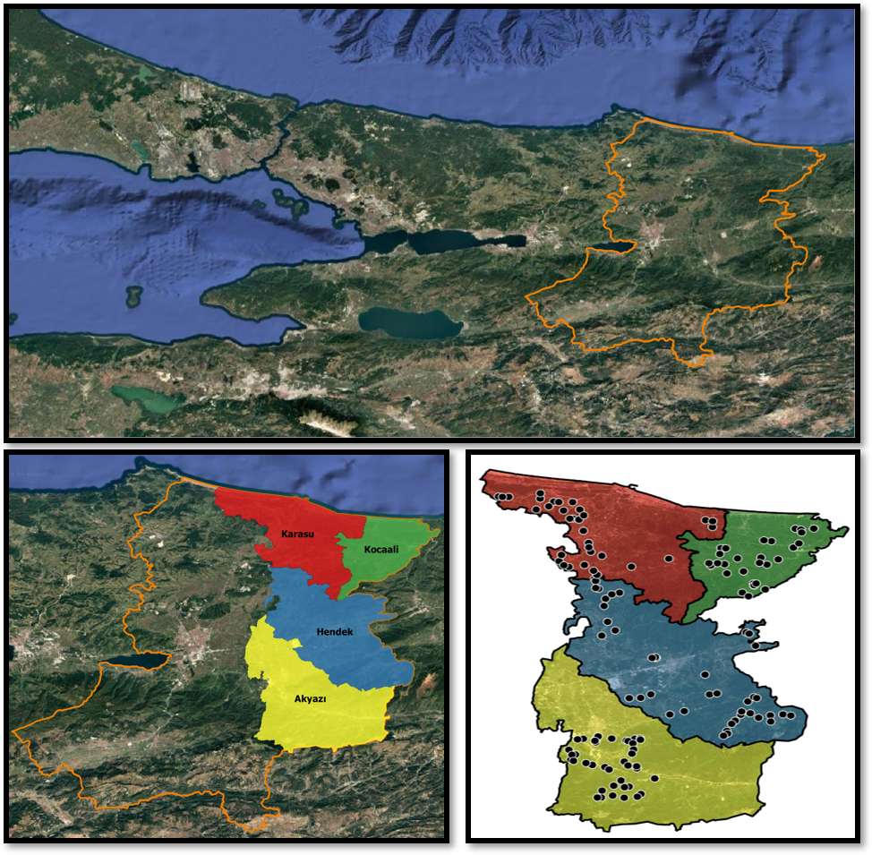
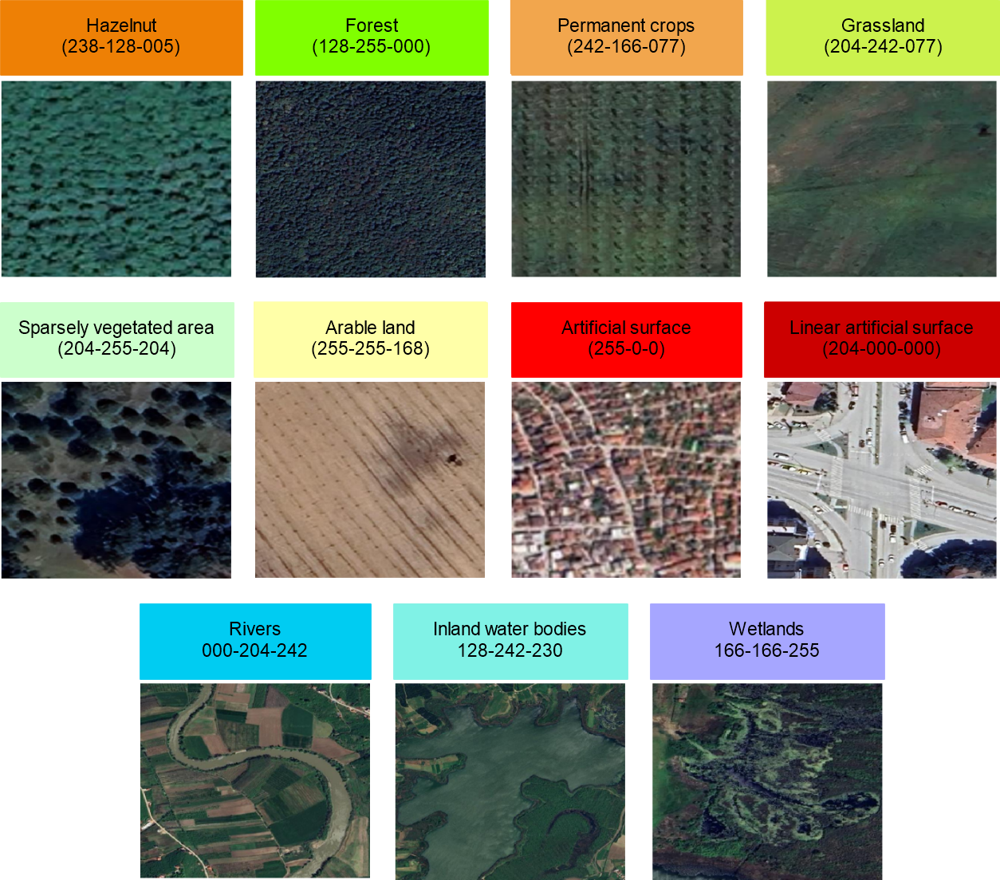
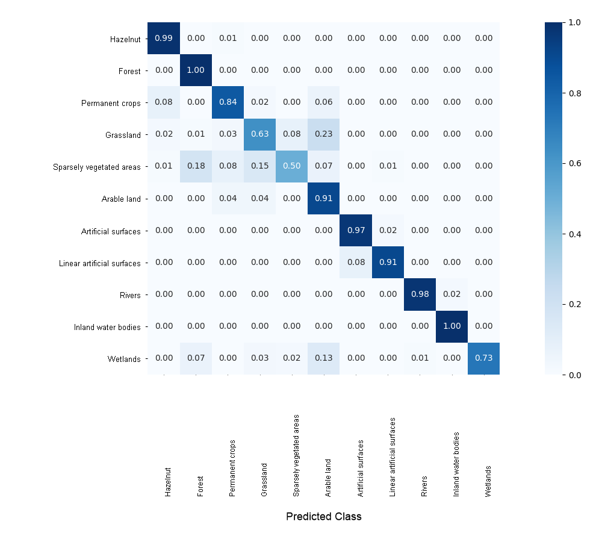
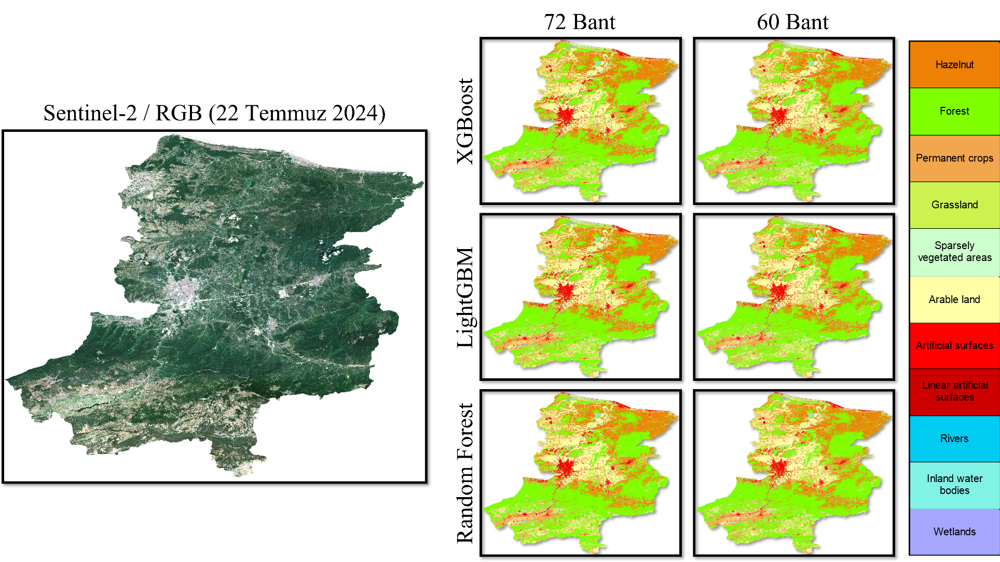
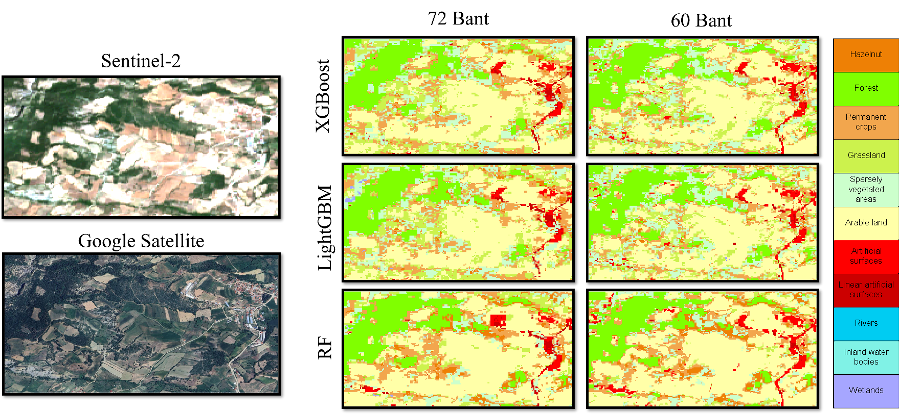
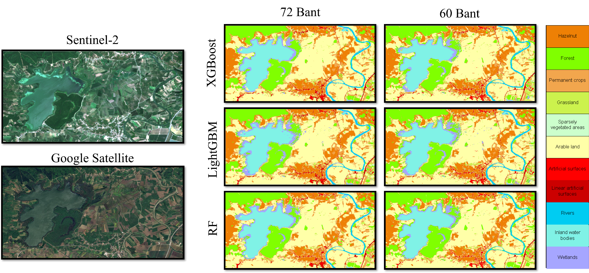
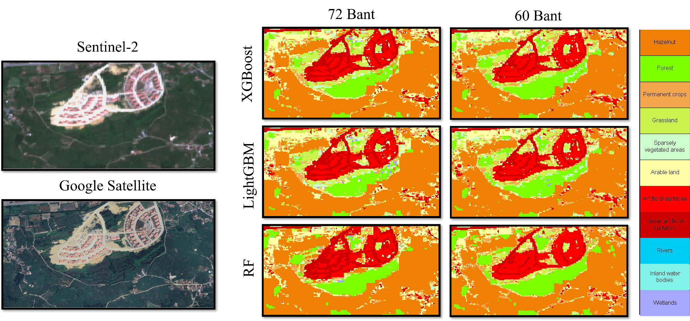

# Machine Learning-Based Hazelnut and Land-Cover Mapping

## Overview

This component maps hazelnut orchards together with ten surrounding land-cover/land-use (LULC) classes across Sakarya Province. Six Sentinel-2 acquisitions representing different hazelnut phenological stages were combined and evaluated with five tree-based ensemble algorithms.

The experiment addresses three questions:

1. How accurately can multi-temporal Sentinel-2 imagery distinguish hazelnut from a heterogeneous provincial landscape?
2. How do bagging and boosting algorithms compare under the same sampling and evaluation framework?
3. What is the effect of retaining or removing the 60 m Aerosol and Water Vapor bands?

## Study area and reference data

The province-wide sample database was compiled from field surveys, expert interpretation, LPIS information, spectral indices, and multi-temporal very-high-resolution basemaps. It contains **6,687 polygon samples** covering approximately **71.3 km²**.

  

Eleven classes were defined:

| Code | Class |
|---:|---|
| 10 | Hazelnut |
| 20 | Forest |
| 30 | Permanent crops |
| 50 | Grassland |
| 60 | Sparsely vegetated areas |
| 70 | Arable land |
| 80 | Artificial surfaces |
| 90 | Linear artificial surfaces |
| 100 | Rivers |
| 110 | Inland water bodies |
| 120 | Wetlands |

  

## Sentinel-2 feature stacks

Processing used the **COPERNICUS/S2_SR_HARMONIZED** collection in Google Earth Engine. All available spectral bands except the Cirrus band (B10) were resampled to 10 m with nearest-neighbor resampling. Six acquisitions were selected:

| Period | Date | Phenological stage |
|---|---|---|
| D1 | 25 December 2023 | leaf fall / winter reference |
| D2 | 19 March 2024 | female flower drop and leaf emergence |
| D3 | 12 June 2024 | fertilization |
| D4 | 22 July 2024 | cluster development and pre-harvest |
| D5 | 16 August 2024 | harvest |
| D6 | 5 October 2024 | post-harvest and pre-leaf fall |

Two configurations were compared:

| Configuration | Features per date | Dates | Total features | Difference |
|---|---:|---:|---:|---|
| 72-feature stack | 12 | 6 | 72 | includes B1 Aerosol and B9 Water Vapor |
| 60-feature stack | 10 | 6 | 60 | excludes B1 and B9 |

The complete Sentinel-2 band table is available in [`data/sentinel2_bands.csv`](../data/sentinel2_bands.csv).

## Sampling and evaluation design

The polygons were divided with a stratified **80% training / 20% test** design. Spatial distribution, polygon counts, represented area, and class proportions were considered during splitting. The test set remained independent of model fitting and hyperparameter search.

| Code | Class | Training area | Test area | Training polygons | Test polygons |
|---:|---|---:|---:|---:|---:|
| 10 | Hazelnut | 79.67% | 20.33% | 80% | 20% |
| 20 | Forest | 80.36% | 19.64% | 80% | 20% |
| 30 | Permanent crops | 80.30% | 19.70% | 80% | 20% |
| 50 | Grassland | 80.03% | 19.97% | 80% | 20% |
| 60 | Sparsely vegetated areas | 78.61% | 21.39% | 80% | 20% |
| 70 | Arable land | 75.51% | 24.49% | 80% | 20% |
| 80 | Artificial surfaces | 78.01% | 21.99% | 80% | 20% |
| 90 | Linear artificial surfaces | 77.67% | 22.33% | 80% | 20% |
| 100 | Rivers | 78.96% | 21.04% | 80% | 20% |
| 110 | Inland water bodies | 78.85% | 21.15% | 80% | 20% |
| 120 | Wetlands | 78.57% | 21.43% | 79% | 21% |

The original table is downloadable as [`data/MachineLearningSamples/sample_split_distribution.csv`](../data/MachineLearningSamples/sample_split_distribution.csv).

## Models and optimization

Five ensemble classifiers were evaluated:

| Model | Family | Main characteristic |
|---|---|---|
| Random Forest | bagging | independently trained randomized decision trees and majority voting |
| Extra Trees | randomized bagging | additional randomization of features and split thresholds |
| XGBoost | boosting | sequential residual correction with regularization |
| CatBoost | boosting | ordered boosting and robust handling of complex feature interactions |
| LightGBM | boosting | leaf-wise tree growth and histogram-based optimization |

Hyperparameters were optimized using `RandomizedSearchCV` with **3-fold cross-validation** and weighted F1 as the selection metric. The optimized models were retrained on the training partition and evaluated on the independent test partition. The exact executable search spaces and selected parameter files will accompany the source-code release; they are not inferred from the thesis text in this documentation snapshot.

## Complete benchmark results

All values below are percentages measured on the independent test set.

| Stack | Model | OA | All-class F1 | All-class IoU | Hazelnut precision | Hazelnut recall | Hazelnut F1 | Hazelnut IoU |
|---|---|---:|---:|---:|---:|---:|---:|---:|
| 72 | XGBoost | **95.49** | **95.43** | **92.35** | 96.79 | 98.51 | **97.64** | **95.39** |
| 72 | CatBoost | 95.08 | 94.97 | 91.63 | 95.35 | 98.38 | 96.84 | 93.88 |
| 72 | LightGBM | 95.44 | 95.41 | 92.28 | 96.77 | 98.42 | 97.55 | 95.22 |
| 72 | Random Forest | 94.90 | 94.67 | 91.16 | 94.71 | 98.26 | 96.45 | 93.13 |
| 72 | Extra Trees | 95.16 | 94.96 | 91.59 | 93.93 | 98.62 | 96.22 | 92.71 |
| 60 | XGBoost | **94.94** | **94.88** | **91.49** | **97.36** | 98.44 | **97.90** | **95.88** |
| 60 | CatBoost | 94.78 | 94.70 | 91.20 | 96.45 | 98.37 | 97.40 | 94.93 |
| 60 | LightGBM | 94.84 | 94.80 | 91.35 | 97.27 | **98.45** | 97.86 | 95.81 |
| 60 | Random Forest | 94.55 | 94.33 | 90.59 | 94.48 | 98.04 | 96.23 | 92.73 |
| 60 | Extra Trees | 94.71 | 94.54 | 90.88 | 92.91 | 98.37 | 96.32 | 92.91 |

Machine-readable results: [`results/classification/model_performance_60_72_bands.csv`](../results/classification/model_performance_60_72_bands.csv).

### Interpretation

- XGBoost achieved the highest all-class and hazelnut F1 scores for both stacks.
- LightGBM closely followed XGBoost, especially in the 60-feature hazelnut experiment.
- Boosting methods generally exceeded the bagging methods, although the differences were small.
- Retaining B1 and B9 improved overall multi-class performance.
- Removing B1 and B9 slightly reduced overall performance but improved hazelnut-specific F1 for all models except Random Forest.
- Even the lowest all-class F1 remained above 94%, demonstrating the strength of the multi-temporal design.

## Confusion-matrix analysis

  

<em>XGBoost, 72-feature stack.</em>

  

<em>XGBoost, 60-feature stack.</em>

Hazelnut and forest were classified with high accuracy in both configurations. The most persistent confusions occurred among spectrally or structurally similar classes:

- sparsely vegetated areas with forest and grassland;
- grassland with arable land;
- wetlands with forest and arable land;
- young or sparse hazelnut orchards with permanent agricultural classes.

The 60 m bands supplied additional information for water-related classes and some narrow artificial features, which helps explain the small overall advantage of the 72-feature stack.

## Province-scale area estimates

The following estimates are in km².

| Class | XGB-60 | XGB-72 | LGBM-60 | LGBM-72 | RF-60 | RF-72 |
|---|---:|---:|---:|---:|---:|---:|
| Hazelnut | 1,043.68 | 1,079.87 | 1,052.05 | 1,085.66 | 1,066.62 | 1,098.30 |
| Forest | 2,612.84 | 2,538.08 | 2,596.43 | 2,520.00 | 2,716.30 | 2,653.50 |
| Permanent crops | 522.62 | 580.56 | 514.98 | 576.34 | 528.92 | 524.32 |
| Grassland | 321.01 | 365.27 | 332.13 | 387.89 | 190.73 | 235.16 |
| Sparsely vegetated areas | 294.66 | 271.74 | 303.00 | 266.99 | 207.00 | 203.75 |
| Arable land | 1,140.00 | 1,104.46 | 1,121.73 | 1,087.55 | 1,252.59 | 1,242.04 |
| Artificial surfaces | 230.25 | 206.27 | 228.48 | 203.39 | 230.59 | 204.71 |
| Linear artificial surfaces | 142.70 | 157.98 | 144.19 | 161.83 | 117.95 | 145.54 |
| Rivers | 16.73 | 17.50 | 15.94 | 16.94 | 13.64 | 13.02 |
| Inland water bodies | 16.93 | 17.34 | 18.58 | 17.52 | 18.24 | 19.47 |
| Wetlands | 13.60 | 15.95 | 27.49 | 30.88 | 12.42 | 15.20 |

The complete source table is available as [`results/classification/class_area_estimates_km2.csv`](../results/classification/class_area_estimates_km2.csv).

XGBoost and LightGBM produced similar area estimates. Random Forest showed larger differences for grassland, forest, and arable land. The 72-feature configurations generally estimated a somewhat larger hazelnut area than their 60-feature counterparts.

## Spatial evaluation

  

Local comparisons showed that most differences occurred at class boundaries and in heterogeneous areas rather than in homogeneous hazelnut or forest regions.

  

  

  

## Full classification maps

The thesis appendix contains the following full-extent model maps:

- [XGBoost, 60 features](../assets/figures/classification/full_map_xgboost_60bands.png)
- [XGBoost, 72 features](../assets/figures/classification/full_map_xgboost_72bands.png)
- [LightGBM, 60 features](../assets/figures/classification/full_map_lightgbm_60bands.png)
- [LightGBM, 72 features](../assets/figures/classification/full_map_lightgbm_72bands.png)
- [Random Forest, 60 features](../assets/figures/classification/full_map_random_forest_60bands.png)
- [Random Forest, 72 features](../assets/figures/classification/full_map_random_forest_72bands.png)

## Reproducibility status

The machine-learning packages are access-controlled, and requests are reviewed by the author:

- [MachineLearningSamples](https://drive.google.com/file/d/1cBJIWvMLubBuWd0LYTsBcosBLHlr45Lg/view?usp=sharing)
- [MachineLearningModels](https://drive.google.com/file/d/1hSgELz7dp6lRwnjn_2HIJrN43a9BI2VE/view?usp=sharing)

This repository provides the experimental design, input metadata, complete benchmark tables, selected visual results, and interpretation. The following items will be added with the source release:

- additional preprocessing and sample-extraction scripts;
- exact `RandomizedSearchCV` search spaces and selected hyperparameters;
- fixed random seeds and software-environment files; and
- versioned inventories and checksums for the external packages.

## Related documentation

- [Phenology and vegetation indices](PHENOLOGY.md)
- [SHAP analysis and feature selection](SHAP_ANALYSIS.md)
- [VHRHazelSeg and deep learning](VHRHAZELSEG_DEEP_LEARNING.md)
- [Main repository](../README.md)
