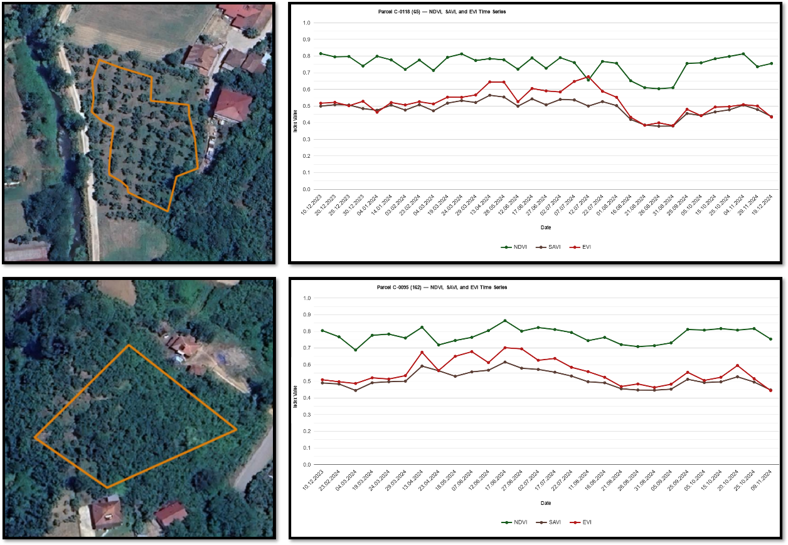
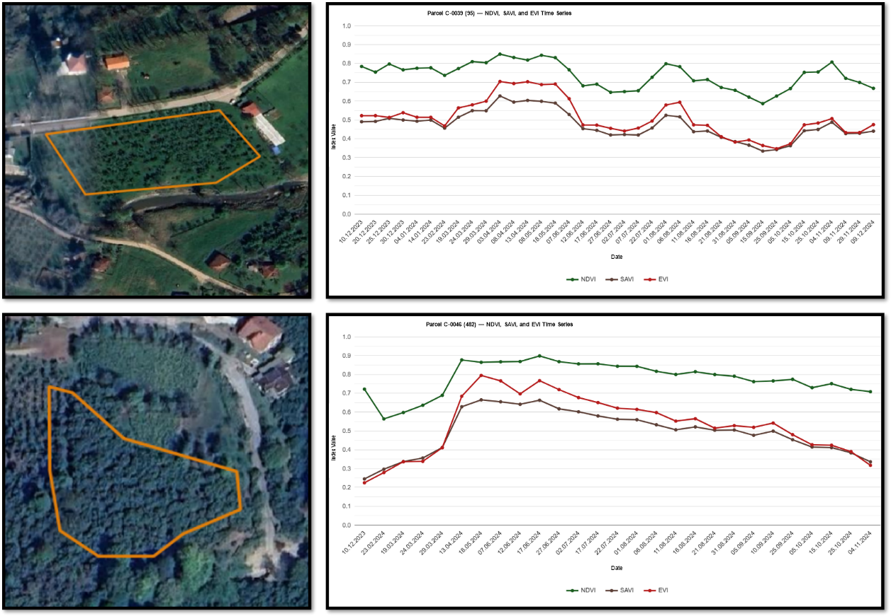
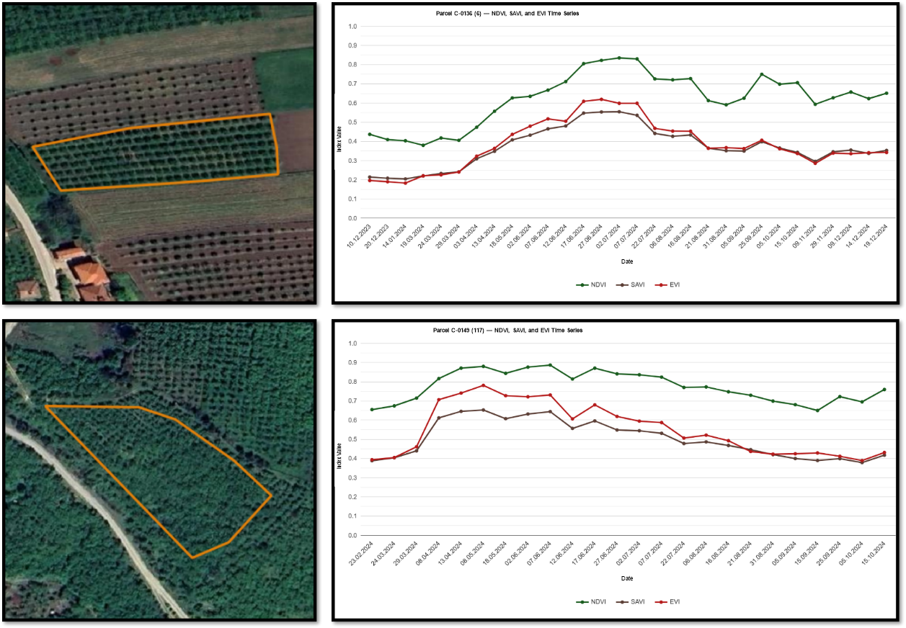
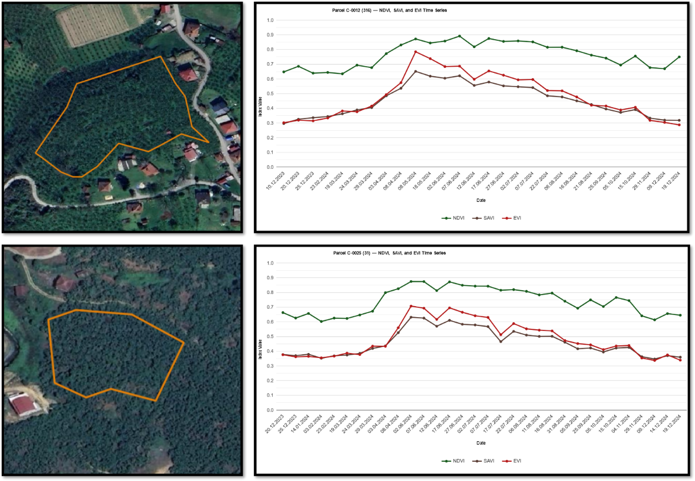
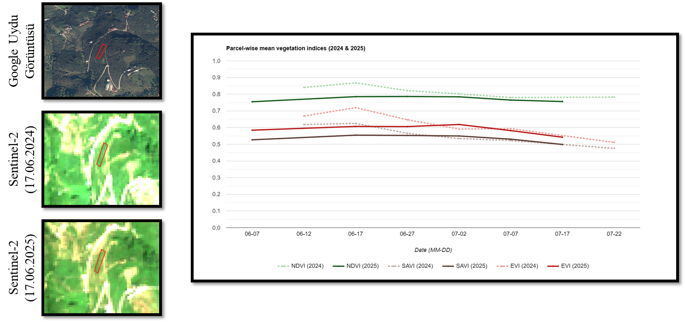
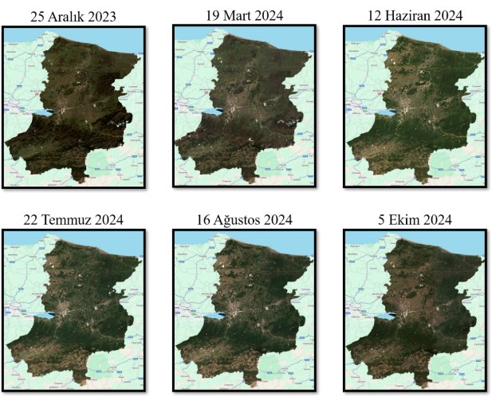

# Hazelnut Phenology and Vegetation-Index Analysis

## Objective

The phenological component evaluates the seasonal spectral response of hazelnut orchards in Sakarya Province using multi-temporal Sentinel-2 observations. NDVI, SAVI, and EVI time series were compared with field knowledge of flowering, leaf emergence, fertilization, cluster development, harvest, and leaf fall.

The analysis served two purposes:

1. characterize the seasonal development of representative hazelnut orchards; and
2. select Sentinel-2 acquisitions that capture spectrally distinct phenological stages for province-scale classification.

## Study locations and sampling

Two representative orchards were selected in each of Akyazı, Hendek, Karasu, and Kocaali. The examples cover differences in planting pattern, canopy density, orchard age, and elevation. A 500 m buffer was used around the selected orchards, and Sentinel-2 observations were filtered using a 5% cloud-cover criterion.

  

## Vegetation indices

The analysis used the following indices:

| Index | Equation | Primary interpretation |
|---|---|---|
| NDVI | `(NIR - Red) / (NIR + Red)` | vegetation greenness and canopy vigor |
| SAVI | `((NIR - Red) / (NIR + Red + L)) × (1 + L)`, with `L = 0.5` | vegetation response with reduced soil-background influence |
| EVI | `G × (NIR - Red) / (NIR + C1 × Red - C2 × Blue + L)` | vegetation response with atmospheric and canopy-saturation corrections |

NDVI was generally the most stable index in dense orchards. SAVI provided a balanced response in young or sparse orchards where soil background was more visible. EVI was more responsive to short-term changes but also showed greater temporal variability.

## Hazelnut phenological calendar

| Phenological stage | Typical period |
|---|---|
| Male flowering | January-February |
| Female flowering | January-February |
| Pollination | January-February |
| Female flower drop and leaf emergence | March-April |
| Fertilization | May-June |
| Cluster development | June-July |
| Harvest | August-September |
| Post-harvest / pre-leaf fall | October |
| Leaf fall | November-December |

The source table is available as [`data/hazelnut_phenology_calendar.csv`](../data/hazelnut_phenology_calendar.csv).

## Time-series period

The primary time-series analysis covered **1 December 2023 to 31 December 2024**. The 2024 season was selected as the principal reference because it provided a more continuous set of radiometrically suitable observations than the frost-affected 2025 season.

Across the representative orchards, vegetation indices generally:

- began increasing with leaf emergence in March-April;
- reached high or maximum levels during fertilization and cluster development in May-June;
- decreased after July as the orchards approached harvest;
- reached lower values during late-season leaf fall.

Orchard structure affected the magnitude and short-term behavior of the indices, but the overall seasonal pattern remained consistent.

## District-level examples

### Akyazı

  

EVI and SAVI began increasing around late March and early April. During May and June, covering fertilization and cluster development, all indices remained high. The denser orchard maintained a more stable NDVI response, while EVI showed stronger short-term variability.

### Hendek

  

The sparse orchard showed similar seasonal trends for all three indices. In the higher-elevation dense orchard, NDVI and SAVI peaked on 17 June 2024, while EVI reacted earlier and showed more pronounced short-term changes.

### Karasu

  

Seasonal development began earlier in the Karasu examples. SAVI gave a relatively balanced response in the younger and sparser orchard, where soil background was more influential. The dense orchard maintained high and stable NDVI values.

### Kocaali

  

All indices increased during leaf emergence and reached their highest levels during fertilization and cluster development. NDVI remained higher and more stable, whereas EVI reacted more sharply to short-term spectral changes.

## Frost comparison

The April 2025 frost event was evaluated by comparing comparable orchard observations from 2024 and 2025. Vegetation-index decreases of approximately **5-10%** were observed in affected areas, demonstrating the potential of multi-temporal satellite indices for identifying abnormal seasonal responses.

  

This comparison is indicative rather than a complete operational frost-damage model. Atmospheric conditions, acquisition timing, orchard structure, and observation availability must be considered when interpreting interannual differences.

## Sentinel-2 dates used for classification

Six radiometrically suitable acquisitions were selected to represent distinct phenological stages:

| Period | Acquisition date | Phenological interpretation |
|---|---|---|
| D1 | 25 December 2023 | leaf fall / winter reference |
| D2 | 19 March 2024 | female flower drop and leaf emergence |
| D3 | 12 June 2024 | fertilization |
| D4 | 22 July 2024 | cluster development and pre-harvest |
| D5 | 16 August 2024 | harvest |
| D6 | 5 October 2024 | post-harvest and pre-leaf fall |

  

These acquisitions form the 72-feature and 60-feature stacks described in the [machine-learning documentation](MACHINE_LEARNING.md).

## Main findings

- Multi-temporal observations were more informative than a single-date view of orchard condition.
- NDVI, SAVI, and EVI captured the same broad seasonal cycle but responded differently to canopy density and short-term variation.
- Fertilization, cluster development, and harvest observations provided strong class-separation potential.
- The 2025 comparison showed that frost-related vegetation stress can be detected as an abnormal temporal response.
- Phenological interpretation provided the foundation for both feature-stack construction and SHAP-based temporal analysis.

## Related resources

- [Machine-learning experiments](MACHINE_LEARNING.md)
- [SHAP analysis](SHAP_ANALYSIS.md)
- [Google Earth Engine application](GEE_APPLICATION.md)
- [Main repository](../README.md)
