# Explainable Machine Learning and SHAP Analysis

## Overview

SHAP (Shapley Additive Explanations) was used to examine how spectral bands and phenological periods contributed to the predictions of the five tree-based classifiers. The analysis was performed for both the 72-feature and 60-feature stacks and at two target levels:

- all 11 LULC classes; and
- the hazelnut class specifically.

The study combines global and local explanations:

| Analysis | Question addressed |
|---|---|
| Mean absolute SHAP importance | Which spectral-temporal inputs have the greatest overall contribution? |
| Ranked top-20 importance | Which compact set of features dominates the model? |
| Spectral-band aggregation | Which bands are important across all dates? |
| Phenological-period aggregation | Which observation periods are important across all bands? |
| Period-by-band aggregation | How does the contribution of each band change over time? |
| Force and waterfall plots | Why were individual samples predicted correctly or incorrectly? |
| SHAP-guided retraining | Can strong performance be retained with fewer features? |

Analyses were performed in Python with SHAP and the corresponding model libraries. SHAP values were interpreted as feature contributions to model output: positive contributions support a prediction, while negative contributions oppose it.

## Feature-stack definitions

| Stack | Composition |
|---|---|
| 72 features | 12 Sentinel-2 bands × 6 phenological dates; includes B1 Aerosol and B9 Water Vapor |
| 60 features | 10 Sentinel-2 bands × 6 phenological dates; excludes B1 and B9 |

The six dates are documented in [Phenology and vegetation-index analysis](PHENOLOGY.md).

## Global SHAP analysis

### XGBoost, 72-feature stack, all classes

  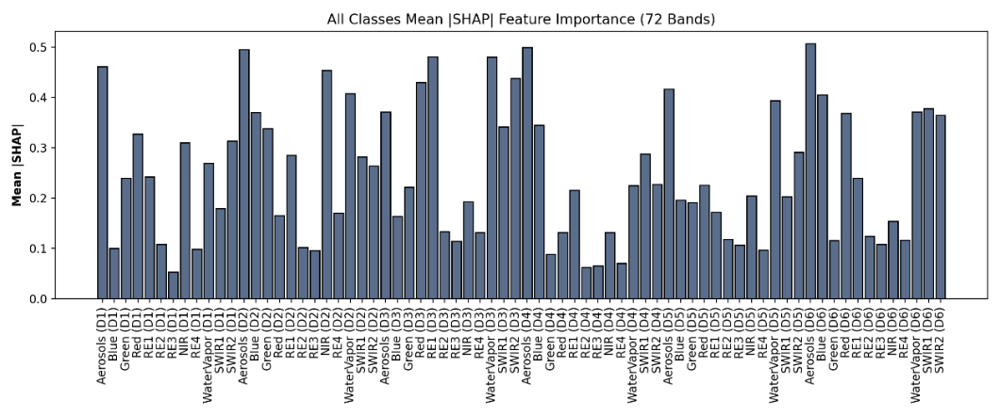

  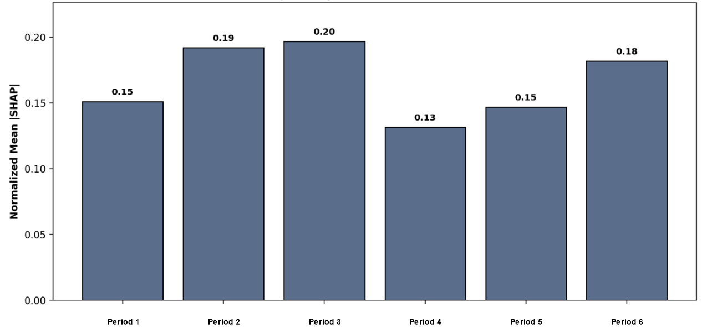

The 72-feature analyses showed strong contributions from the 60 m Aerosol and Water Vapor bands for several models. Their dominance should not be interpreted as direct physiological sensitivity alone: they may also encode atmospheric, seasonal, or acquisition-specific variation correlated with class separation.

### XGBoost, 72-feature stack, hazelnut class

  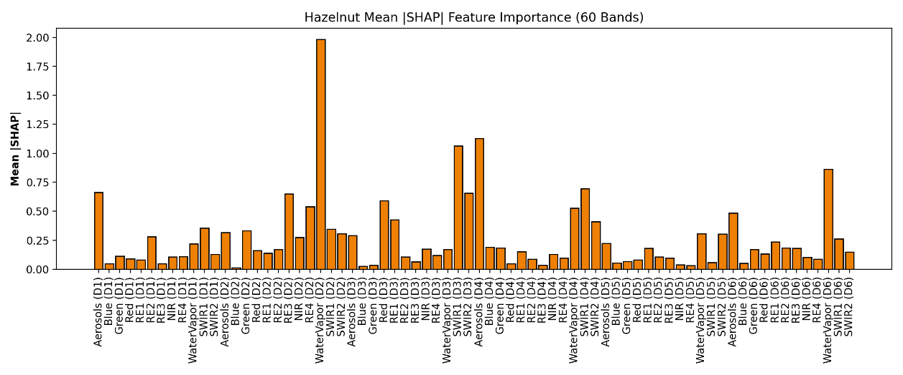

  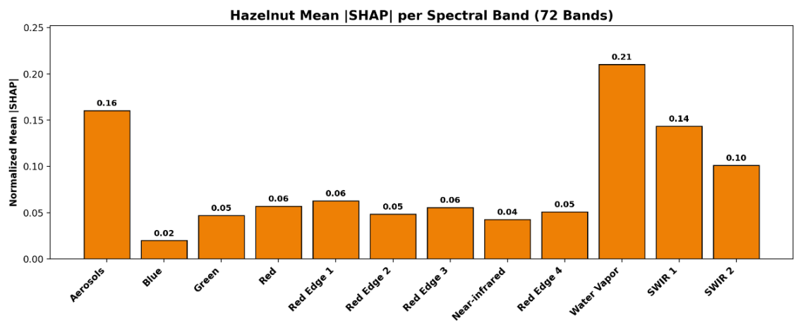

Hazelnut-specific explanations did not always follow the same ordering as the all-class analysis. This distinction motivated separate feature-selection experiments for overall classification and the target class.

### XGBoost, 60-feature stack, all classes

  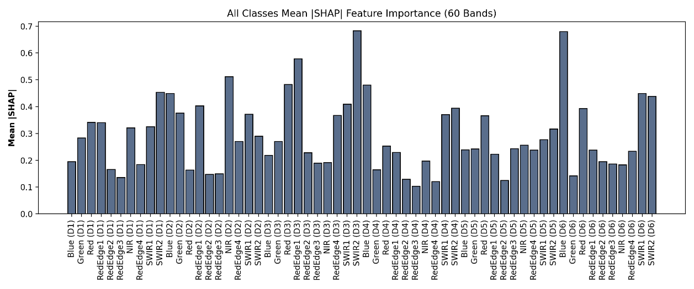

  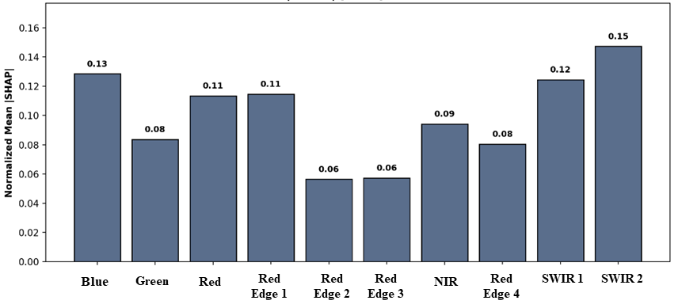

  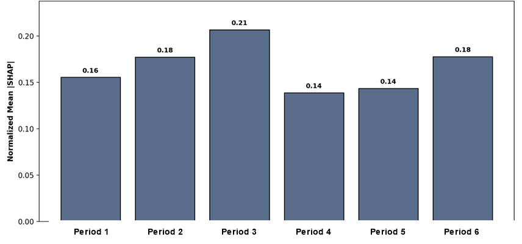

After B1 and B9 were removed, Red Edge and SWIR features became more prominent. When all classes were considered together, the June fertilization period generally carried the highest influence.

### XGBoost, 60-feature stack, hazelnut class

  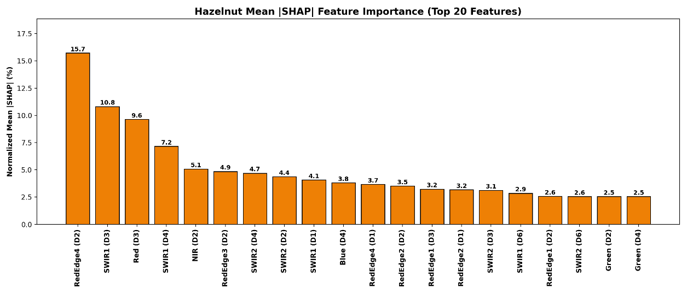

  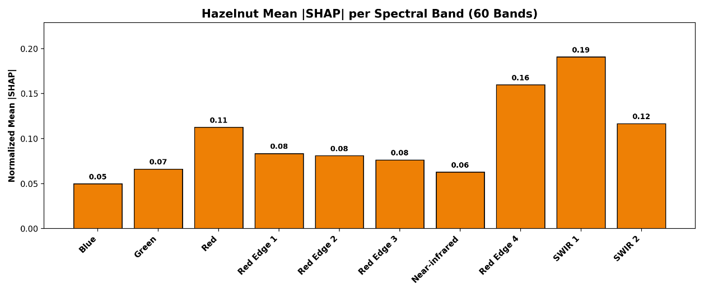

  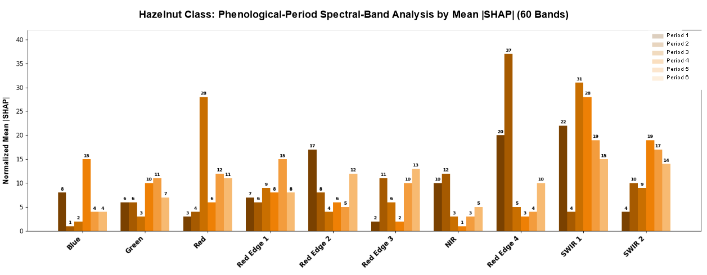

For hazelnut-focused analysis, the March female-flower-drop and leaf-emergence period became particularly informative. The top features were dominated by Red Edge and SWIR observations, with contributions changing by date.

## Spectral and phenological interpretation

The combined analyses support the following interpretation:

- **Red Edge:** important during early seasonal development and leaf emergence, when chlorophyll and canopy structure begin changing.
- **Red:** particularly informative during the June fertilization period even when its importance was lower at other dates.
- **NIR:** contributed strongly to all-class separation during early periods, but was less dominant in some hazelnut-specific rankings.
- **SWIR:** became more influential during and after leaf emergence, reflecting changes in canopy moisture and structure.
- **B1 Aerosol and B9 Water Vapor:** supplied strong predictive signals in several 72-feature models, but their coarse spatial resolution and atmospheric sensitivity require careful interpretation.

The importance of a band is therefore not fixed: it depends on acquisition date, target class, model, and the presence or absence of other features.

## Single-period experiments

Each date was independently evaluated with XGBoost using either 12 bands or 10 bands. Values are percentages.

| Bands | Period | OA | All-class F1 | All-class IoU | Hazelnut precision | Hazelnut recall | Hazelnut F1 | Hazelnut IoU |
|---:|---|---:|---:|---:|---:|---:|---:|---:|
| 12 | D1 | 88.95 | 88.25 | 81.52 | 75.93 | 81.09 | 78.43 | 64.51 |
| 12 | D2 | 89.98 | 89.17 | 83.25 | 81.10 | 86.56 | 83.74 | 72.03 |
| 12 | D3 | 91.37 | 91.04 | 85.99 | 92.37 | 95.92 | 94.11 | 88.87 |
| 12 | D4 | 91.68 | 91.29 | 86.53 | 94.12 | 97.40 | 95.73 | 91.81 |
| 12 | D5 | 91.27 | 90.85 | 85.97 | 94.50 | **97.75** | **96.10** | 92.49 |
| 12 | D6 | **92.18** | **91.67** | **86.75** | 91.75 | 96.29 | 93.97 | 88.62 |
| 10 | D1 | 87.59 | 86.82 | 79.33 | 72.94 | 75.98 | 74.43 | 59.27 |
| 10 | D2 | 89.46 | 88.71 | 82.39 | 80.29 | 85.31 | 82.72 | 70.53 |
| 10 | D3 | 90.83 | 90.51 | 85.28 | 92.02 | 95.63 | 93.79 | 88.31 |
| 10 | D4 | **91.75** | **91.30** | **86.50** | 94.23 | **97.42** | 95.80 | 91.94 |
| 10 | D5 | 91.12 | 90.79 | 85.83 | **95.03** | 97.25 | **96.13** | **92.54** |
| 10 | D6 | 91.29 | 90.83 | 85.58 | 92.12 | 95.54 | 93.80 | 88.32 |

Machine-readable table: [`results/explainable_ai/phenological_period_performance.csv`](../results/explainable_ai/phenological_period_performance.csv).

Early D1-D2 observations were least effective when used alone. Classification improved markedly during D3-D5. The highest hazelnut F1 occurred during harvest (D5), while the best all-class result occurred at D6 for the 12-band data and D4 for the 10-band data.

## Local SHAP analysis

Local explanations were generated from polygons for which every contained pixel was either completely correctly or completely incorrectly classified. The selected cases included:

- correctly classified hazelnut samples;
- hazelnut samples predicted as permanent crops;
- permanent-crop samples predicted as hazelnut; and
- other vegetation-related confusions.

  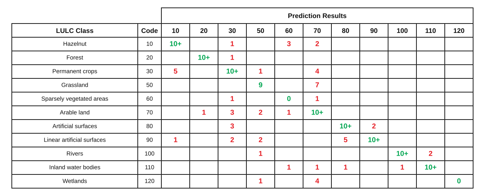

Examples of correct and incorrect local explanations:

  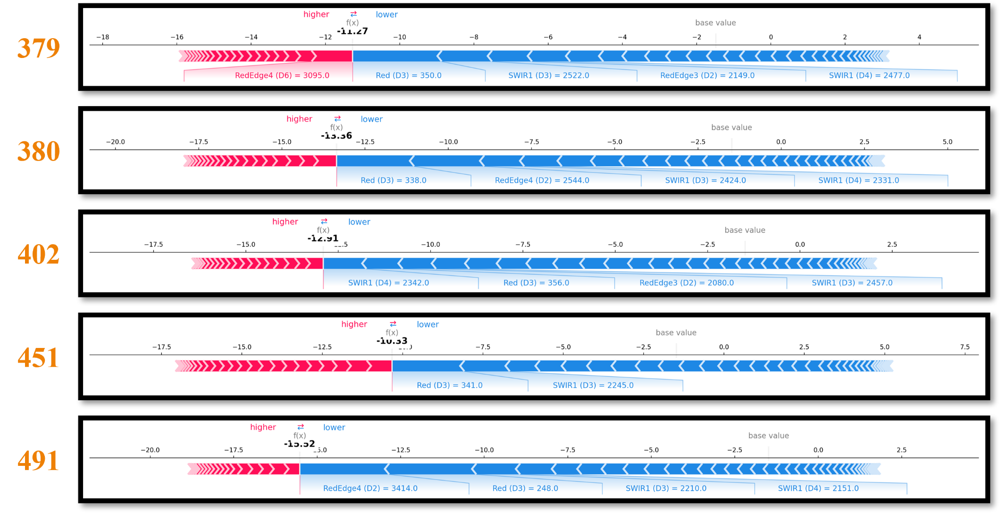

  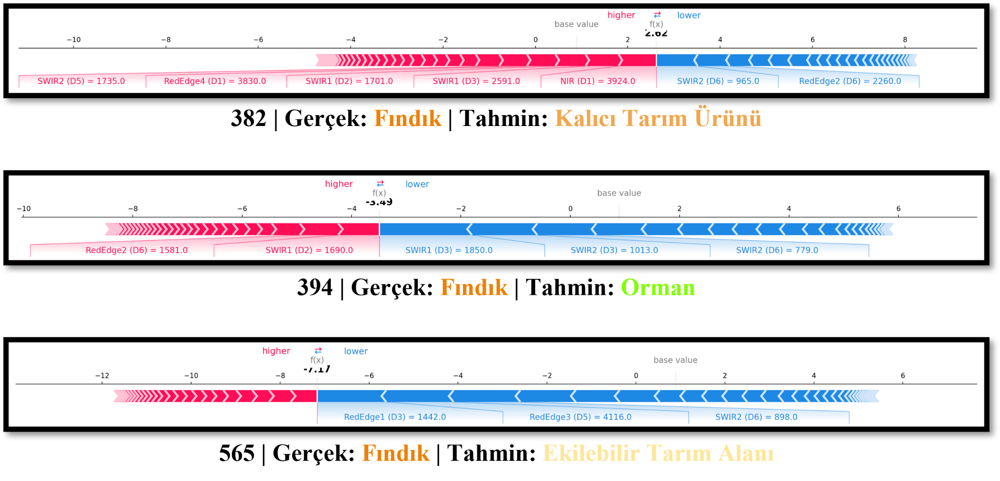

Dense and homogeneous orchards were generally easier to classify. Young and sparse orchards showed greater similarity to permanent agricultural land. Red Edge, NIR, and SWIR reflectance trajectories also differed among correctly and incorrectly classified samples.

Detailed inputs are available in:

- [`local_shap_samples.csv`](../results/explainable_ai/local_shap_samples.csv)
- [`local_sample_reflectance.csv`](../results/explainable_ai/local_sample_reflectance.csv)

Additional force and waterfall plots are stored under [`assets/figures/shap/`](../assets/figures/shap/).

## SHAP-guided feature combinations

Five feature-selection strategies were evaluated with XGBoost:

| Combination | Selection rule |
|---|---|
| K1 | 20 features with the highest SHAP contribution |
| K2 | K1 after removing features from the weak D1 and D2 periods |
| K3 | the strongest phenological observation for each spectral band |
| K4 | the D4 and D5 periods combined |
| K5 | the single most influential spectral band from each phenological period |

The complete feature lists are provided in [`selected_feature_combinations.csv`](../results/explainable_ai/selected_feature_combinations.csv).

### Complete retraining results

| Selection basis | Stack | Combination | All-class F1 | Hazelnut F1 |
|---|---:|---|---:|---:|
| All-class SHAP | 72 | K1 | **94.55** | 96.60 |
| All-class SHAP | 72 | K2 | 92.41 | 95.22 |
| All-class SHAP | 72 | K3 | 93.34 | 95.79 |
| All-class SHAP | 72 | K4 | 92.41 | 96.61 |
| All-class SHAP | 72 | K5 | 89.41 | 87.77 |
| All-class SHAP | 60 | K1 | 94.39 | **97.22** |
| All-class SHAP | 60 | K2 | 92.59 | 95.84 |
| All-class SHAP | 60 | K3 | 92.76 | 95.21 |
| All-class SHAP | 60 | K4 | 92.56 | 96.61 |
| All-class SHAP | 60 | K5 | 89.45 | 89.50 |
| Hazelnut SHAP | 72 | K1 | 94.39 | 96.66 |
| Hazelnut SHAP | 72 | K2 | 92.20 | 94.67 |
| Hazelnut SHAP | 72 | K3 | 92.75 | 96.15 |
| Hazelnut SHAP | 72 | K4 | 92.46 | 96.65 |
| Hazelnut SHAP | 72 | K5 | 90.04 | 90.33 |
| Hazelnut SHAP | 60 | K1 | 93.87 | 96.69 |
| Hazelnut SHAP | 60 | K2 | 91.99 | 95.24 |
| Hazelnut SHAP | 60 | K3 | 92.43 | 95.28 |
| Hazelnut SHAP | 60 | K4 | 92.56 | 96.61 |
| Hazelnut SHAP | 60 | K5 | 90.59 | 92.32 |

The full OA, IoU, precision, and recall table is available as [`feature_combination_performance.csv`](../results/explainable_ai/feature_combination_performance.csv).

### Interpretation

- K1 produced the strongest reduced-feature results.
- The all-class SHAP ranking generated the best feature set for both all-class and hazelnut objectives.
- Removing D1 and D2 from K1 reduced performance, showing that individually weak periods can still add complementary information in a multi-temporal stack.
- K4 retained strong hazelnut performance by combining the informative pre-harvest and harvest periods.
- K5 was too aggressive and produced the weakest reduced-feature results.
- The best reduced 60-feature-derived K1 configuration reached **97.22% hazelnut F1**, close to the full-stack maximum of 97.90%.

## Limitations

- SHAP importance measures model behavior, not physical causality.
- Coarse atmospheric bands may encode acquisition-specific or seasonal context in addition to surface information.
- Correlated spectral features can share or redistribute importance.
- Local explanations are sample-specific and should not be generalized without global evidence.
- The feature-selection results are tied to this sample design, region, season, and model configuration.

## Related documentation

- [Phenology and vegetation indices](PHENOLOGY.md)
- [Machine-learning experiments](MACHINE_LEARNING.md)
- [VHRHazelSeg and deep learning](VHRHAZELSEG_DEEP_LEARNING.md)
- [Main repository](../README.md)
