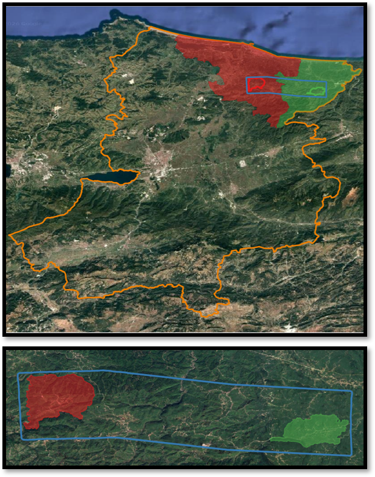
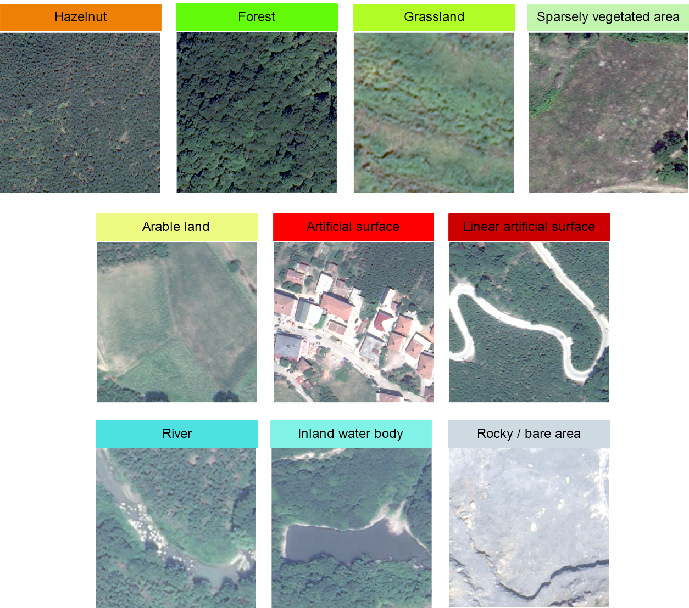
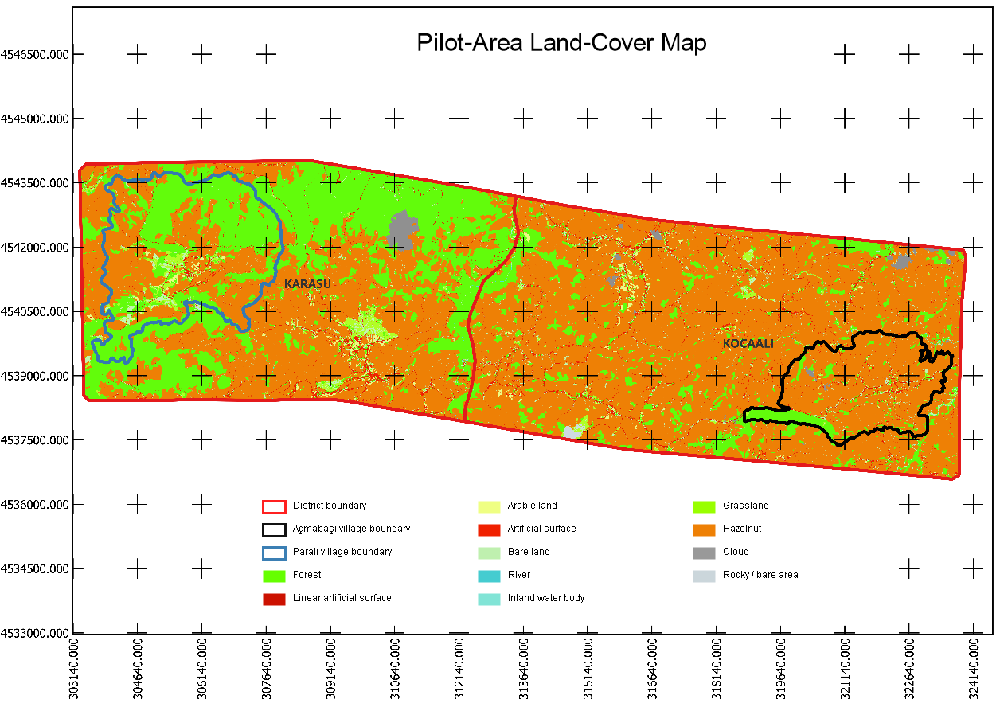
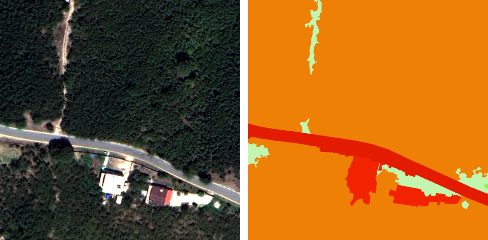
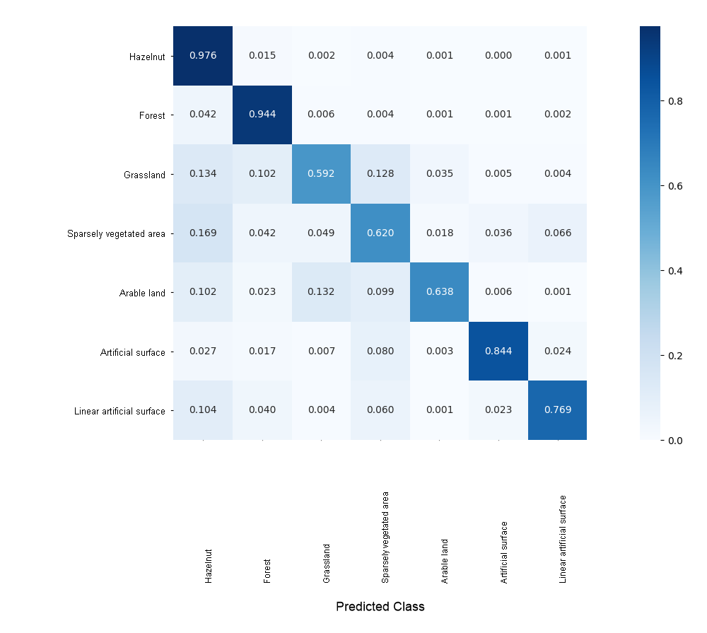
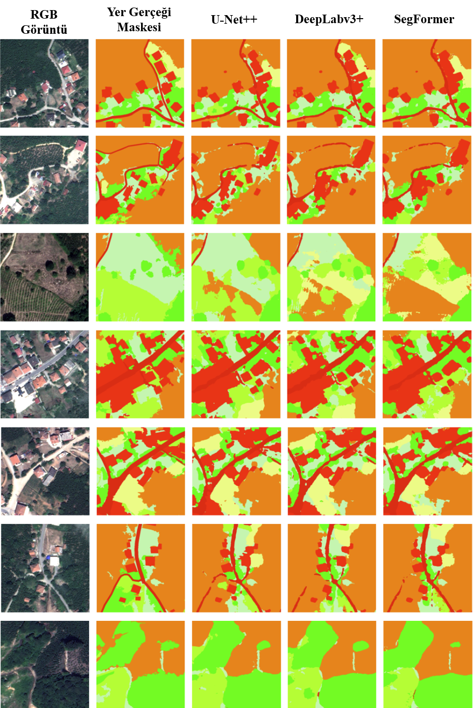

# VHRHazelSeg and Deep-Learning Semantic Segmentation

## Overview

The deep-learning component evaluates detailed land-cover and hazelnut segmentation in a nearly **110 km²** pilot area using very-high-resolution Pléiades Neo imagery. It complements the province-scale Sentinel-2 classification by resolving field boundaries, buildings, roads, and heterogeneous vegetation patterns at substantially finer spatial detail.

The workflow includes:

1. Pléiades Neo preprocessing and pan-sharpening;
2. GEOBIA-assisted reference-label generation;
3. 512 × 512 image-mask patch production;
4. stratified train/validation/test splitting;
5. U-Net++, DeepLabv3+, and SegFormer training; and
6. quantitative and qualitative evaluation.

## Study area and imagery

  

Pléiades Neo supplies a 0.30 m panchromatic band and 1.20 m multispectral bands. The multispectral imagery contains Deep Blue, Blue, Green, Red, Red Edge, and NIR bands. Orthorectification used TanDEM-X elevation information; the panchromatic and multispectral products were fused to create 0.30 m pan-sharpened imagery.

Band metadata are available in [`data/pleiades_neo_bands.csv`](../data/pleiades_neo_bands.csv).

> 

>
> The original Pléiades Neo imagery is not redistributed. Any release of imagery-derived samples remains subject to the applicable license and distribution review.
>
> 

## GEOBIA-assisted ground truth

Reference labels were generated with a Geographic Object-Based Image Analysis workflow. Multi-resolution segmentation was adjusted to local landscape structure: larger scale parameters were used for broad homogeneous areas, while smaller values were used for heterogeneous and detailed objects.

Rule-based classification combined:

- spectral information and vegetation indices (NDVI, SAVI, EVI, and NDWI);
- brightness and NIR thresholds;
- geometric features such as rectangular fit and roundness;
- GLCM texture features; and
- manual digitization and correction for roads, buildings, and erroneous segments.

  

The resulting label map was manually reviewed before patch generation.

  

## VHRHazelSeg dataset

RGB imagery and corresponding masks were converted to 8-bit, three-channel products and divided into **512 × 512 pixel** patches. A **12.5% overlap (64 pixels)** was applied in both directions. Patches containing NoData areas were removed.

The final VHRHazelSeg dataset contains **5,873 image-mask pairs**.

  

### Class composition

| Class | RGB code | GEOBIA area (ha) |
|---|---|---:|
| Hazelnut | 238-128-5 | 7,575.54 |
| Forest | 128-255-0 | 2,779.72 |
| Grassland | 204-242-77 | 169.24 |
| Sparsely vegetated area | 204-255-204 | 218.24 |
| Arable land | 255-255-168 | 72.84 |
| Artificial surface | 255-0-0 | 123.15 |
| Linear artificial surface | 204-0-0 | 153.13 |
| River | not assigned | 9.61 |
| Inland water body | not assigned | 0.30 |
| Rocky / bare area | not assigned | 11.39 |
| Cloud | not assigned | 82.43 |

Total labeled area: **11,195.59 ha**. The source table is available as [`data/VHRHazelSeg/class_area_distribution.csv`](../data/VHRHazelSeg/class_area_distribution.csv).

### Dataset split

The patches were stratified to preserve the overall class distribution and the balance of single-class and multi-class patches.

| Split | Patches | Share |
|---|---:|---:|
| Training | 4,111 | 70% |
| Validation | 881 | 15% |
| Test | 881 | 15% |
| **Total** | **5,873** | **100%** |

Class proportions were highly stable across all partitions. Hazelnut accounted for approximately 68.85% of pixels, forest for 24.73%, and the remaining classes collectively represented the minority share. The complete split table is available as [`split_class_distribution.csv`](../data/VHRHazelSeg/split_class_distribution.csv).

## Evaluated architectures

### U-Net++

U-Net++ uses nested and dense skip connections to reduce the semantic gap between encoder and decoder feature maps. Its multi-scale feature fusion was evaluated for detailed parcel and boundary segmentation.

### DeepLabv3+

DeepLabv3+ combines atrous spatial pyramid pooling with a decoder that restores fine spatial detail. Depthwise separable convolutions improve computational efficiency.

### SegFormer

SegFormer combines a hierarchical transformer encoder with a lightweight MLP decoder. MiT-B0, MiT-B1, and MiT-B2 variants were evaluated before the final cross-model comparison.

### Encoder configuration

SE-ResNeXt50 was used as the backbone in the final cross-model comparison. It combines residual learning, grouped convolutions, and squeeze-and-excitation channel attention. The SegFormer MiT tests were retained as a separate encoder study.

## Training configuration

| Setting | Value |
|---|---|
| Framework | PyTorch |
| Compute environment | Kaggle, NVIDIA Tesla P100 GPU |
| Input | 512 × 512 RGB patches |
| Loss | alpha-based Focal Loss |
| Output activation | Softmax |
| Optimizer | Adam |
| Initial learning rate | 0.0001 |
| Learning rate after epoch 15 | 0.00001 |
| Maximum epochs | 30 |
| Data augmentation | none |
| Early stopping | validation F1, patience of 5 epochs |
| Checkpoint selection | best validation performance |

## SegFormer MiT encoder study

The values below were measured on the test set.

| Encoder | Loss | Accuracy | IoU | F1 | Precision | Recall |
|---|---:|---:|---:|---:|---:|---:|
| MiT-B0 | 0.1181 | 0.9812 | 0.8866 | 0.9340 | 0.9345 | 0.9335 |
| MiT-B1 | 0.1178 | 0.9821 | 0.8919 | 0.9374 | 0.9377 | 0.9371 |
| MiT-B2 | **0.1177** | **0.9830** | **0.8962** | **0.9404** | **0.9408** | **0.9401** |

Machine-readable table: [`results/segmentation/segformer_encoder_performance.csv`](../results/segmentation/segformer_encoder_performance.csv).

SE-ResNeXt50 subsequently produced the strongest SegFormer configuration and was used for the final architecture comparison.

## Complete architecture results

| Architecture | Split | Loss | Accuracy | IoU | F1 | Precision | Recall |
|---|---|---:|---:|---:|---:|---:|---:|
| U-Net++ | Train | 0.1155 | 0.9929 | 0.9517 | 0.9751 | 0.9752 | 0.9750 |
| U-Net++ | Validation | 0.1169 | 0.9863 | 0.9099 | 0.9520 | 0.9522 | 0.9519 |
| U-Net++ | Test | 0.1171 | 0.9856 | **0.9098** | **0.9497** | 0.9499 | **0.9496** |
| DeepLabv3+ | Train | **0.1153** | **0.9936** | **0.9566** | **0.9777** | **0.9778** | **0.9775** |
| DeepLabv3+ | Validation | 0.1170 | 0.9859 | 0.9074 | 0.9505 | 0.9510 | 0.9501 |
| DeepLabv3+ | Test | 0.1171 | **0.9856** | 0.9097 | **0.9497** | **0.9501** | 0.9493 |
| SegFormer | Train | 0.1158 | 0.9916 | 0.9436 | 0.9707 | 0.9711 | 0.9703 |
| SegFormer | Validation | 0.1170 | 0.9856 | 0.9056 | 0.9496 | 0.9501 | 0.9491 |
| SegFormer | Test | 0.1171 | 0.9854 | 0.9085 | 0.9489 | 0.9494 | 0.9485 |

Machine-readable table: [`results/segmentation/model_performance_train_val_test.csv`](../results/segmentation/model_performance_train_val_test.csv).

### Result interpretation

- DeepLabv3+ produced the highest training metrics.
- U-Net++ provided the highest validation F1 and IoU.
- U-Net++ and DeepLabv3+ shared the highest test F1 at 0.9497.
- U-Net++ had the highest test IoU by a margin of 0.0001 over DeepLabv3+.
- SegFormer remained very close, with 0.9489 test F1 and 0.9085 test IoU.
- Similar training, validation, and test performance indicates strong generalization under the selected split.

## Confusion-matrix analysis

  

Hazelnut and forest were highly separable. The largest confusions occurred among grassland, sparsely vegetated areas, and arable land. Linear artificial surfaces were more difficult than broad artificial areas because roads and other narrow features are spatially fragmented and frequently surrounded by vegetation.

## Qualitative evaluation

The visual assessment used multi-class test patches containing heterogeneous land-cover patterns.

  

  

Observed model behavior:

- U-Net++ produced balanced and spatially consistent predictions in broad homogeneous areas.
- DeepLabv3+ provided stable separation across spectrally similar grassland and arable-land transitions.
- SegFormer often preserved sharper narrow structures such as roads.
- All models occasionally confused hazelnut with spectrally or structurally similar vegetation, particularly in mixed or transition areas.

## Multi-resolution perspective

| Component | Spatial role | Strength |
|---|---|---|
| Sentinel-2 machine learning | province-scale mapping | broad coverage and multi-temporal phenological information |
| Pléiades Neo deep learning | detailed pilot-area segmentation | parcel boundaries, small objects, roads, and heterogeneous landscape structure |

The two components are complementary rather than interchangeable. Sentinel-2 supports repeatable regional monitoring, while Pléiades Neo provides the spatial detail required for fine-scale segmentation.

## Reproducibility and availability

The deep-learning packages are access-controlled, and requests are reviewed by the author:

- [VHRHazelSeg](https://drive.google.com/file/d/1n90xCnEwWvugkVdm5QeeLBdUNdBtBNkR/view?usp=sharing)
- [DeepLearningModels](https://drive.google.com/file/d/15ufC5lv32Mf0C3o-XSfgS_mfDY-ZQoO_/view?usp=sharing)

The repository provides dataset construction details, class and split tables, training settings, benchmark results, and selected visual outputs. Planned source-release components include:

- dataset preparation and patch-generation scripts;
- model training and inference scripts; and
- versioned inventories and checksums for the external packages.

The original commercial Pléiades Neo imagery is not redistributed.

## Related documentation

- [Machine-learning experiments](MACHINE_LEARNING.md)
- [SHAP analysis](SHAP_ANALYSIS.md)
- [Phenology and vegetation indices](PHENOLOGY.md)
- [Main repository](../README.md)
